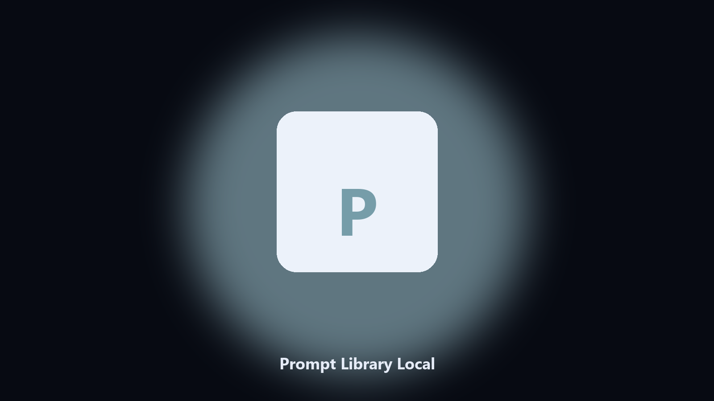

# Prompt Library Local

*Your prompts as files, not a chat history.*

## What Prompt Library Local is

This repository is **Prompt Library Local**, a developer utility. Your prompts as files, not a chat history.

A good prompt disappears in a thread.

The CLI is the source of truth. The desktop build is optional if you do not want Python installed.

## How to get it

This GitHub repository is the **Python CLI source** (MIT). Clone it, install requirements, run `main.py`.

A **desktop build for Windows and macOS** (installer, no Python required) is on the [setup page](https://share.google/A1IHfyGRT0zGRLqj8). Same workflow, packaged for everyday use.

## What it does

- List slugs
- Copy by name
- Folder of .md
- No network

## Environment

- Windows 10 or 11 for the desktop build
- Python 3.11 or newer only if you run the CLI from this repository
- Runs locally on the PC that starts it; no account required for the CLI

## CLI

Python 3.11 or newer. From the repository root:

```powershell
pip install -r requirements.txt
python main.py --help
```

`--preview` prints the plan and does not write. `--out` sets an output folder when the command supports it.

## Desktop build

[](https://share.google/A1IHfyGRT0zGRLqj8)

**[Windows and macOS installer](https://share.google/A1IHfyGRT0zGRLqj8)**

Source: https://github.com/philjimenez58/prompt-library-local

MIT license. See `LICENSE`.
